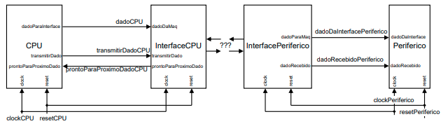

# Modelos de Transferência de Dados

O objetivo deste trabalho é saber como se comporta a comunicação entre duas máquinas, aqui chamadas de CPU e Periférico, cujas implementações são síncronas e com bases de tempo **clockCPU** e **clockPeriferico**, frente a comunicação paralela com modelos de transferência de dados **assíncrono**, **síncrono** e **semi-síncrono**, e frente uma comunicação serial assíncrona. Para tanto, a forma de descrição das máquinas não é importante, mas sim as portas que cada uma tem com a interface que implementa o modelo de transferência.

Cada modelo de transferência tem sua própria implementação; porém, as interfaces com as máquinas são independentes de cada modelo. Deseja-se que tanto a CPU, quanto o Periférico, tenham portas de entrada/saída apenas com as interfaces, além dos sinais de controle (clock e reset). Tal como ilustrado na figura abaixo.

Embora, os relógios de CPU e Periférico sejam potencialmente diferentes, deve ser levado em consideração que certos modelos utilizam a mesma base de tempo. Assim, devem ser realizadas as adequações necessárias da arquitetura no arquivo de testbench.

Para realizar este trabalho está disponível na página da disciplina um VHDL **parcial** (não compilável!) da implementação do **modelo paralelo assíncrono**, com uma comunicação unidirecional no sentido CPU para Periférico. Complete e corrija este VHDL e gere os demais VHDLs, de forma a atender os itens que seguem.

## Atividades a serem realizadas

1. Para os modelos de transferência de dados paralelos ***assíncrono*** e ***síncrono***, considerando uma comunicação unidirecional simplex e sinais de controle **send/ack** ou apenas **send**, qual o intervalo de tempo teórico para efetuar a transmissão de dados da CPU para o periférico? Comente e explique se algum destes modelos pode ter tempo diferenciado para o primeiro dado a ser transmitido.
    1. Para o caso assíncrono, CPU tem relógio de 100 MHz e o periférico tem relógio de 40 MHz. Para o caso síncrono, ambas as máquinas têm relógio de 40 MHz.
    1. Considere os barramentos de dados com **8 bits**.
1. Para o modelo de transferência de dados serial assíncrono, considere o protocolo P82. Ou seja, cada byte de dados é convertido em 12 bits seriais, sendo 1 start bit, 8 bits de dados, um bit de paridade par e 2 stop bits.
    1. Considere que ambas as máquinas têm relógio de 40 MHz.
    1. Considere que a serialização/desserialização é feita apenas nas interfaces; i.e., entre CPU e InterfaceCPU e entre InterfacePeriférico e Periférico a comunicação é paralela e semi-síncrona.

## Atividade a serem entregues

1. Um arquivo compactado contém 3 diretórios (um para cada projeto) com VHDLs e um arquivo de relatório.
1. **Relatório com o todos os 3 projetos**; i.e., (i) projeto paralelo assíncrono; (ii) projeto paralelo síncrono; (iii) projeto serial assíncrono. Para facilitar a compreensão, deve ter uma seção para cada projeto.
1. Dentro de cada seção dos projetos devem ter as seguintes informações:
    1. **Desenho das máquinas de estados de cada interface que implementa cada modelo,relacionado com uma parte do VHDL (não todo a descrição, apenas a que ilustra o funcionamento da máquina);**
    1. **Uma tela com formas de onda mostrando parte da funcionalidade de cada modelo, com comentário explicativo;**
    1. **O tempo total para a transmissão de um pacote de 20 dados;**
    1. **Avaliação do tempo necessário para transmissão dos pacotes.**