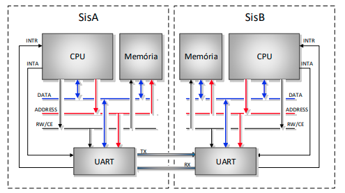
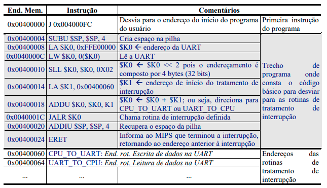
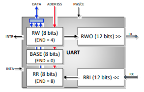

# Trabalho II - Versão 9

## Características introdutórias

* Sistema computacional composto por dois conjuntos computacionais independentes denominados de SisA e SisB, cada um contendo CPU, Memória e UART;
* A comunicação SisA e SisB ocorre através de uma UART (Universal Asynchronous Receiver/Transmitter);
* Para cada conjunto computacional, a CPU é mestre do barramento (single master), com entrada/saída mapeada em memória;
* A CPU pode a qualquer momento acessar a memória ou a UART através de instruções LW e SW - leitura e escrita, respectivamente;
* O mecanismo de interrupção serve para a UART avisar que tem dados para enviar à CPU ou para solicitar dados da CPU.

**Figura 1: - Sistema computacional composto por dois conjuntos independentes de CPU, memória e UART, com comunicação através de uma serial assíncrona.**

## Operação da interrupção

1. Toda a vez que a UART finalizar a recepção de um dado, ou iniciar a transmissão de um dado, ela deve informar à CPU, através de um pedido de interrupção;
1. A UART requer interrupção à CPU via sinal de controle **INTR**;
1. A CPU, estando apta a atender à interrupção, responde através do sinal **INTA** e inicia o processamento da interrupção correspondente.

## Modificações na CPU (MIPS)

As modificações no código básico do MIPS entregue ao aluno envolvem principalmente o bloco de controle e a inclusão dos sinais externos **INTR** e **INTA**. Note que foi incluída uma nova instrução – **ERET** – para a rotina de tratamento de interrupção informar ao hardware o término de sua execução.

### Procedimento de tratamento da interrupção - software

Para ser possível trabalhar com interrupções, devem ser definidos os tratamentos das interrupções e onde gravar o “**vetor de interrupções**”. Abaixo temos um exemplo de código, supondo que:

* O programa principal (semelhante a um Sistema Operacional - SO) inicia na posição 0x00400000;
* O programa do usuário inicia na posição 0x004000FC;
* O trecho de programa que analisa a interrupção requerida pela UART (no caso interrupção de envio ou de recepção de dados) e desvia para o endereço de tratamento inicia na posição 0x00400004;
* O vetor de interrupções está armazenado nos endereços 0x00000060 e 0x00000064 (neste trabalho temos apenas a UART com possibilidade de gerar interrupções referentes à transmissão ou recepção de dados). Assim, o endereço 0x00000060 é referente à transmissão de dados para a UART (CPU_TO_UART) e o endereço 0x00000064 é referente à recepção de dados da UART (UART_TO_CPU);
* UART está mapeada em memória na posição 0xFFE00000.

O código acima deve ser carregado junto com o programa do usuário (ver um exemplo completo ao final deste documento).

### Procedimento de tratamento da interrupção

Processador deve realizar as seguintes atividades:

* Salvar o **PC** (em um registrador interno ao processador) e desviar a execução do programa para a posição de memória 0x00400004 (**PC <- 0x00400004**);
* Setar o registrador interno **EM_INT** para informar que está em atendimento de interrupção. Este registrador deve permanecer em um enquanto estiver na rotina de interrupção e somente voltar a zero quando a interrupção terminar. **Ele serve como uma flag para que não possa ser possível entrar duas interrupções simultâneas (sistema não aceita aninhamento de interrupção)**;
* Ativar sinal **INTA**, sinalizando para a UART que o pedido será atendido;
* Voltar para o ciclo de busca de instrução, para a instrução contida no endereço 0x00400004;

Ao encontrar a instrução **ERET** significa que terminou o tratamento da interrupção corrente, o **PC** deve voltar ao antigo valor e o registrador **EM_INT** deve ser resetado. Note que os demais registradores devem voltar ao estado anterior à interrupção (recuperação de contexto). Isto possivelmente deve ter sido feito em software.

## Projeto da UART

As UARTs devem operar com um modelo de comunicação bidirecional full-duplex assíncrono. O dado deve ser transmitido por uma serial conforme protocolo N82 (8 bits de dados e dois stop bits além do start bit).

A comunicação full-duplex acontece através de dois canais paralelos e simétricos. Um que parte de SisA e vai para SisB, que deve ser referenciado por **TX**, e outro com direção oposta, que deve ser referenciado por **RX**.

Devido à limitação de apenas um par de sinais de controle de interrupção (**INTR** e **INTA**) para dois canais de comunicação presentes em cada UART, o pedido de interrupção dos canais da UART para a CPU é feito de forma multiplexada. Para saber qual o canal associado (i.e., se é uma interrupção informando que o dado está saindo da UART ou está entrando), a CPU deve ler o endereço base da UART (**EnderecoUART** = 0xFFE00000) (tipicamente com uma instrução do tipo LW ou LB). Este endereço base deve acessar o registrador **BASE**. Fica definido que, caso o conteúdo do registrador **BASE** for 0, a interrupção é de saída (UART transmitiu um dado), sendo necessário que a CPU transmita novos dados para a UART. Esta nova produção de dados deve ocorrer dentro da interrupção com endereço **CPU_TO_UART**. Caso o conteúdo do registrador **BASE** for 1, a interrupção é de entrada (UART recebeu um dado), sendo necessário consumir o dado recebido. Este consumo deve ocorrer dentro da interrupção com endereço **UART_TO_CPU**.

**Figura 2 – Organização de blocos com os principais elementos da UART.**

Para a transmissão de dados, a UART tem um registrador de escrita (**RW**) e um registrador de deslocamento de saída (**RWO**). O **RW** é um registrador de 8 bits, enquanto que o RWO é de 12 bits, de forma a suportar o protocolo N82 (start bit, paridade e stop bit são registrados junto aos dados no RWO). O **RW** é acessado pela CPU através do endereço **EnderecoUART + 4**. A cada escrita em **RW**, a UART tenta inicialmente transferir o dado para o **RWO**. Caso o **RWO** esteja ocupado, a UART espera terminar a transmissão de todos os bits serialmente, para então copiar **RW** para **RWO**. A transferência de um dado de **RW** para **RWO** gerar um pedido de interrupção para a CPU. Nesta interrupção (i.e., **CPU_TO_UART**), a CPU pode inserir mais um dado no **RW**. A conversão do dado de 8 bits para o protocolo é feita internamente a UART e de forma transparente para a CPU.

Para a recepção de dados, a UART tem um funcionamento análogo ao da transmissão. Esta, dispõe de um registrador de leitura (**RR**) e um de deslocamento de entrada (**RRI**). **RR** é um registrador de 8 bits, enquanto que o **RRI** é de 12 bits, de forma a suportar o protocolo N82. O **RR** é acessado pela CPU através do endereço **EnderecoUART + 8**. O **RR** recebe o dado de **RRI** sempre que o **RRI** completar a recepção de um dado segundo o protocolo serial, e neste evento, a UART deve gerar um pedido de interrupção para a CPU (i.e., **UART_TO_CPU**). Nesta interrupção, a CPU deve ler o dado disponível em **RR**. Note que, caso a CPU não leia o dado a tempo, então pode ocorrer uma sobre escrita de **RR** com um novo dado proveniente da serial. Este problema não é tratado neste trabalho. A conversão do protocolo de N82 para o dado de 8 bits é feita internamente a UART de forma transparente para a CPU.

Note que devido ao sistema ser full-duplex, a UART deve tratar a possibilidade de requisição de dois pedidos de interrupção simultâneos. Ou seja, pedidos dos canais **RX** e **TX**. Desta forma, ela deve ter um mecanismo para enfileirar os pedidos de interrupção, de forma a não perder os mesmos.

## Projeto do Sistema

A operação completa do sistema implica em fazer no alto nível a transferência de uma mensagem com o conteúdo “**Isto é um teste**” de SisA para SisB, e obter como resposta a mensagem “**Teste compreendido**” (de SisB para SisA). Desta forma, embora os sistemas suportem comunicação full-duplex, apenas uma comunicação half-duplex será realizada. Ao término da execução, as memórias dos conjuntos computacionais destino deverão ter todas as mensagens transmitidas pelos conjuntos computacionais de origem. Assim, os alunos devem implementar em software, tanto um programa de transmissão, quanto um programa de recepção.

## A Fazer e Entregar

1. Modificar a arquitetura do MIPS (e.g., MR2) e validar a modificação por simulação;
1. Implementar a UART e validar por simulação;
1. Implementar no MARS o software do sistema e verificar se o mesmo está adequado;
1. Implementar o sistema completo e validar por simulação;
1. Simular um programa com atendimento de interrupção. Mostrar a execução do programa, o momento que o mesmo é interrompido, e a volta ao programa principal;
2. Dois testes adicionais que podem ser fora da execução básica do programa:
    1. Simular uma interrupção aninhada e provar que esta não ocorre devido ao sinal **EM_INT**;
    1. Simular uma interrupção de entrada, enquanto uma de saída está sendo tratada e mostrar que esta não é perdida -> é enfileirada;
1. Relatório do projeto.

## Passos para iniciar o trabalho

Passos: (i) Salvar os **arquivos** do projeto em uma área de trabalho; (ii) Abrir o simulador VHDL de sua preferência; (iii) Iniciar um novo projeto; (iv) Adicionar os arquivos vhd e txt que estão no zip ao projeto; (v) Iniciar as atividades...