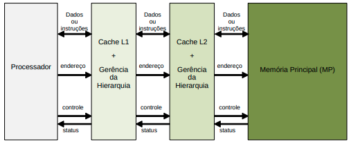
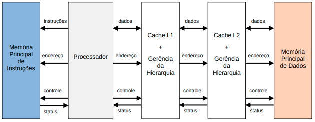
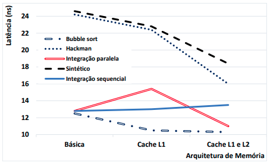

# Hierarquia de Memória Cache – Versão 20

Este documento descreve o terceiro trabalho da disciplina de Arquitetura de Computadores II, que consiste na implementação de um sistema de gerenciamento da hierarquia de memória. Este gerenciamento deve ser descrito em VHDL, e simulado junto com o processador utilizado no Trabalho 2 ou similar.

A seguir está apresentada uma hierarquia de memória com três níveis: (i) cache de nível 1 (L1), (ii) cache de nível 2 (L2) e (iii) Memória Principal (MP).

O processador se comunica com a hierarquia de memória através das portas de: (i) **endereço** - aponta para o endereço de um dado ou instrução; (ii) **controle** - habilita o acesso à memória e define se este acesso é de leitura ou escrita; (iii) **status** - indica se a informação já foi lida ou escrita na/da memória; e (iv) **dados ou instruções** - porta bidirecional no caso da memória ser de dados (efetua escrita e leitura), e porta unidirecional no caso da memória ser de instruções (só leitura).

Independente da implementação, pois o aluno tem algumas liberdades de escolha, os sinais provenientes do processador devem ir diretamente para o nível logo abaixo da hierarquia de memória, e cada nível será responsável por gerar os endereços para o nível subsequente.

Cada nível de cache tem um conjunto de sinais que reportam o resultado da operação de leitura, tais como miss ou hit. Para cada nível, também, devem ser direcionados sinais de controle, bem como endereços.

**O objetivo deste trabalho é implementar uma hierarquia de dados com 3 níveis (L1, L2 e MP)**, sendo a hierarquia de instruções implementada apenas com um nível (MP). A memória de instruções deve ser implementada através de um arquivo contendo um código executável do processador. **Este código deve ser descrito de forma a verificar a funcionalidade da hierarquia da memória que está sendo implementada**. Assim, um programa que testa a hierarquia de memória deve fazer diversos acessos, forçando que ocorram alguns casos de cache miss e outros de cache hit de forma a explorar a localidade espacial e temporal do programa. O arquivo que contém o código executável do processador pode ser obtido com um programa assembly do MIPS sendo entrada para o montador do processador (e.g., MARS).

Na hierarquia de dados, considere que para o nível 1 a cache tem 4 linhas, e cada bloco tem 4 palavras. A cache de nível 2 tem 8 linhas e cada tem linha 8 palavras. Considere, também, uma MP com 8 K palavras.

Entre cada nível da hierarquia de memória deve ser considerado um atraso parametrizável. A cache L1 deve operar na mesma frequência do processador (acesso com um ciclo de relógio). A cache L2 tem tempo de acesso de 4 ciclos de relógio, enquanto que a MP tem tempo de acesso de 16 ciclos de relógio. Para implementação das caches de dados devem ser consideradas um tipo de mapeamento e um mecanismo para manter a integridade de dados, tal como descrito a seguir: (i) **Cache L1 - mapeamento direto como write-through**; (ii) **Cache L2 - mapeamento associativo como writeback, e regra de substituição através de um contador** no caso de miss com cache cheia. Demais características de implementação, não definidas aqui, estão livres para serem escolhidas.

Ao final do trabalho o aluno terá uma arquitetura semelhante a que segue na figura abaixo. Note que o relógio não é apresentado, mas deve ter os valores descritos acima.

## Realização do trabalho

O trabalho deverá ser realizado em **no máximo** grupos de até 3 (três) alunos, e ser entregue até o dia descrito na agenda da disciplina. **Deve ser entregue um relatório descrevendo as atividades feitas, juntamente com os arquivos fonte VHDL da implementação do trabalho e os arquivos com os experimentos utilizados**. É importante descrever a validação da gerência da hierarquia de memória. Note que validar este tipo de sistema implica diversos experimentos: tais como sucessivos miss e hits.

**Espera-se que os grupos, apresentem gráficos de como ficam as latências de cinco programas (feitos pelos alunos, eventualmente copiados de livros ou Internet) para uma arquitetura sem cache (básica), com cache apenas de nível 1 e com cache de nível 1 e 2, tal como exemplificado a seguir**. *Um destes cinco programas têm que ser acesso a vetor/matriz de forma a privilegiar localidade temporal/espacial; enquanto o outro deve operar exatamente de forma inversa, ou seja, prejudicando a localidade.*

