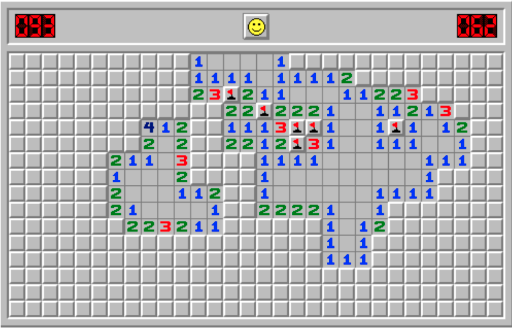
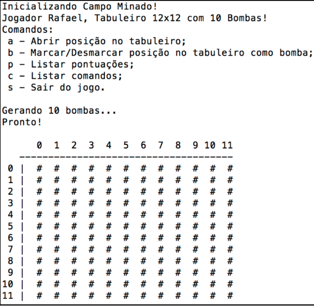
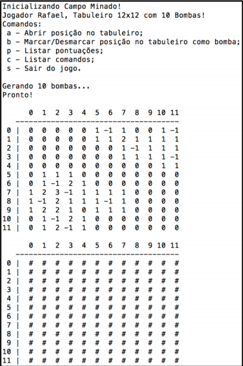
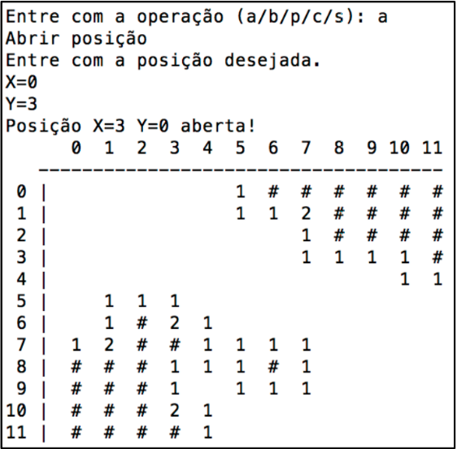
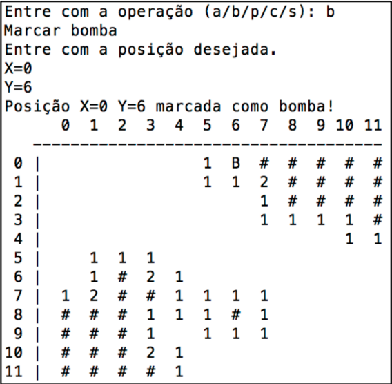
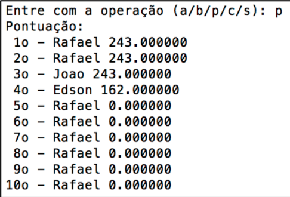
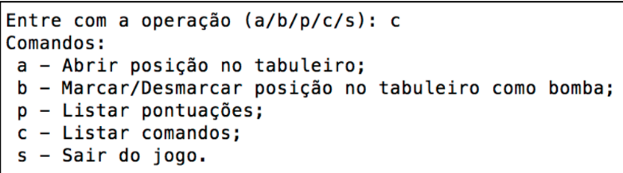
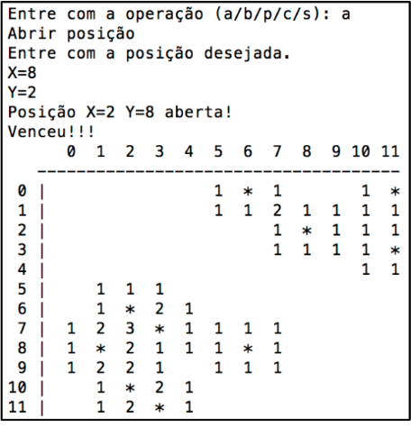

# Trabalho Final

## Introdução
O objetivo deste trabalho é praticar a programação utilizando a linguagem C para resolver problemas computacionais através da implementação de um jogo de campo minado. O jogo é composto por um tabuleiro e o objetivo é abrir todas as casas desse tabuleiro (ou células), menos aquelas que contêm bombas.Bombas podem ser marcadas durante o jogo, para evitar que o jogador abra erroneamente uma casa que ele saiba que contém uma bomba. Além disso, conforme o jogo avançe, e as casas vão sendo abertas, o jogador consegue identificar casas que contenham bombas analisando casas vizinhas. Isso é possível, pois cada casa deve indicar com um número, a quantidade de bombas existentes em casas vizinhas, como mostra o exemplo abaixo. O jogo chega ao fim caso o jogador abra uma bomba ou caso todas as casas que não contém bombas sejam abertas.



Um site para testar o jogo: http://minesweeperonline.com/

## Funcionamento e detálhes técnicos
### Funcionamento
Para a execução do jogo, o jogador deve fornecer três parâmetros: (i) o nome do jogador; (ii) a largura do tabuleiro; e (iii) o número de bombas. A ordem dos parâmetros na chamada do jogo deve ser (i), (ii) e (iii). Por exemplo, assumindo o jogador **Rafael**, com um tabuleiro de largura **12** e **10** bombas, o jogo será chamado assim:

```bash
./campo_minado Rafael 12 10
```

O jogo deve então ser inicializado. O tabuleiro deverá ser sempre quadrado e as bombas devem ser posicionadas de forma randômica. Células que ainda não foram abertas devem ser representadas pelo seguinte caractere: `#`. O jogo deve então apresentar as opções para o jogador: **(a) Abrir posição no tabuleiro; (b) Marcar/Desmarcar posição no tabuleiro como bomba; (p) Listar pontuações; (c) Listar comandos; e (s) Sair do jogo**. A tela inicial deve ser semelhante à Figura 1 mostrada abaixo:

|
:-------------------------:|:-------------------------:
**Figura 1:** Tela Inicial do Jogo. | **Figura 2:** Tela Inicial do Jogo no modo DEBUG.

Para ajudar no desenvolvimento do trabalho. Podemos chamar o programa no modo `DEBUG`, isso faz com que vejamos se o tabuleiro foi corretamente iniciado. Para entrarmos nesse modo, como mostra a `Figura 2`, o jogo deverá ser executado da seguinte maneira:

```bash
./campo_minado Rafael 12 10 DEBUG
```

Caso o jogador **selecione abrir uma posição no tabuleiro**, o programa deve solicitar a célula com coordenadas XY. Nesse tabuleiro, X representa o eixo horizontal e Y o eixo vertical e a célula X=0 Y=0 deve ser aquela do canto superior esquerdo. Ou seja, a numeração de células do tabuleiro cresce para a direita (no eixo X) e para baixo (no eixo Y). Por exemplo, se o jogador desejar abrir a posição X=0 e Y=3 e a célula não esteja próxima a nenhuma bomba (`valor=0`), a função deve seguir expandindo todas células vizinhas, até chegar nas proximidades de células com bombas (`células com valor>0`).

No exemplo abaixo (`Figura 3`), a abertura da célula X=0 e Y=3 desencadeou a abertura de todas as vizinhas até as margens de células que contém bombas. Note que células que não possuem nenhuma vizinha com bombas são impressas como um caractere em branco, ou “ ”. As demais células têm o número de bombas vizinhas impressas em suas posições correspondentes, para guiar o jogador na identificação de bombas. Note que o jogador não pode abrir células marcadas como bomba, apenas células em branco (`#`).

Caso o jogador **opte por marcar, ou desmarcar, uma célula como bomba**, o jogo deve trocar o valor impresso na célula (`#`), pelo caractere “`B`”, que identifica bomba. Caso a célula já esteja marcada como bomba, o jogo deve mudar a célula para o valor impresso na célula para `#`. Por exemplo, se o jogador desejar marcar a célula X=0 e Y=6 como bomba, o jogo deve escrever “`B`” na posição correspondente, conforme mostra a `Figura 4`.

|
:-------------------------:|:-------------------------:
**Figura 3:** Tela durante o jogo. | **Figura 4:** Tela durante o jogo.

Se o jogador optar pela opção **listar a pontuação** (`Figura 5`), o programa deve exibir um ranking com os 10 melhores jogadores. Caso o jogador optar pela opção de **listar comandos** (`Figura 6`), uma mensagem deve ser impressa explicando a funcionalidade de cada uma das opções do jogo. Se o jogador optar por **sair do jogo,** o jogo é finalizado.

|
:-------------------------:|:-------------------------:
**Figura 5:** Tela com a pontuação. | **Figura 6:** Tela com os comandos.

O jogo continua enquanto o jogador abrir células ou marcar (e desmarcar) bombas. O jogo termina quando o jogador abre uma célula que contém uma bomba ou quando todas as células sem bombas estiverem abertas. Se o jogador abrir uma célula com bomba, o jogo deve imprimir uma mensagem dizendo que o jogador perdeu, atualizar o ranking de melhores jogadores e imprimir os 10 melhores jogadores. Se o jogador abrir todas as células, o jogo deve imprimir uma mensagem dizendo que o jogador venceu, atualizar o ranking e imprimir os 10 melhores jogadores. Na atualização de ranking, o jogo deve acrescentar o jogador corrente, independente de derrota ou vitória, de acordo com sua pontuação. A pontuação (P) é definida por:

```bash
P = (lado * lado) * (num_bombas) * (pct_celulas)
```

Onde:

```bash
pct_celulas = celulas_abertas/((lado * lado) - num_bombas)
```
No final do jogo o tabuleiro completo deve ser impresso (`Figura 7`), demonstrando o valor de todas casas e todas bombas. Bombas devem ser identificadas pelo caractere “`*`”. Por exemplo:



**Figura 7:** Tela de fim de jogo.

### Implementação

Utilizar o código em C fornecido no Moodle como estrutura inicial para o desenvolvimento do trabalho. Conforme descrito no código, o seguinte registro é utilizado para representar as células (ou casas) do tabuleiro:

```c
struct celula {
    char imprime;
    int valor;
};
```

Onde `valor` é o membro que representa o número de bombas em células vizinhas e `imprime` é o membro que representa o caractere que será impresso para o jogador. O tabuleiro deve ser sempre quadrado e inicializado através de um parâmetro do programa fornecido pelo jogador. Ou seja, o tabuleiro deve ser **um ponteiro do tipo registro “celula”** e a alocação de espaço na memória utilizado para representá-lo deve ser realizada em tempo de execução (**alocação dinâmica**). Além disso, o tabuleiro deve seguir um mapeamento XY, onde X representa o eixo horizontal e Y o eixo vertical, e a célula X=0 Y=0 deve ser aquela do canto superior esquerdo. Ou seja, a numeração de células do tabuleiro cresce para a direita (no eixo X) e para baixo (no eixo Y).

Em resumo, **o trabalho consiste em completar o código fornecido através da implementação dos seguintes trechos de códigos**:

#### Item 1
1. `A`: Escrever um trecho de código para verificar a consistência de dados de entrada do
programa (argc e argv).
2. `B`: Escrever um trecho de código para para inicializar as variáveis do jogo (jogador,
lado_tabuleiro e num_bombas) de acordo com os argumentos de entrada.
3. `C`: Escrever um trecho de código para inicialização do tabuleiro e alocação de espaço em
memória (usar malloc).

#### Item 2 (gera_bombas):
```c
void gera_bombas(struct celula *tabuleiro, int lado, int num_bombas);
```
Essa rotina é responsável por criar bombas no tabuleiro de forma aleatória (colocar `-1` no campo valor do registro celula). Para tanto, usar uma semente para inicialização da função `rand()`: **srand(time(NULL))**. Essa rotina recebe por parâmetro a referência para o tabuleiro, juntamente com o tamanho do lado do tabuleiro e o número total de bombas.

#### Item 3 (le_vizinho)
```c
int le_vizinho(int x, int y, int posicao, int controle, struct celula *tabuleiro, int lado);
```
Essa função facilita a implementação de funções como `expandir zeros no tabuleiro` e de `cálculo de valor de células`. Ela recebe por parâmetro um deslocamento XY (que varia entre -1, 0 e 1), uma célula do tabuleiro, um valor de controle, a referência para o tabuleiro e o lado do tabuleiro. A função `retorna um campo do registro celula`, no caso **o valor** (se **controle==0**) ou **o valor a ser impresso** (se **controle==1**) da célula vizinha.

`Por exemplo:`

Assumindo coordenadas XY, temos o seguinte tabuleiro 4x4:
```
00 10 20 30
01 11 21 31
02 12 22 32
03 13 23 33
```

`Assumindo que o usuário solicite leitura do vizinho x=-1 e y=0, da célula 22, a função deverá
retornar o valor ou o caracter a ser impresso da célula 12.`

#### Item 4 (calcula_celulas)
```c
void calcula_celulas(struct celula *tabuleiro, int lado);
```
Essa rotina deve calcular os valores de controle de cada célula do tabuleiro. Os valores correspondem ao número de bombas existentes nas suas células vizinhas. Olhe a `Figura 2` do modo “DEBUG” para um exemplo prático. Dica: use internamente a função `le_vizinho()`.

`Por exemplo:`

Assumindo coordenadas XY, temos o seguinte tabuleiro 3x3:
```bash
00 10 20
01 11 21
02 12 22
```

`Assumindo que o usuário esteja calculando o valor da célula 22. Se seus vizinhos (12 e 21) conterem bomba(-1), o valor da célula 22 deverá ser 2.`

#### Item 5 (imprime_tabuleiro)
```c
void imprime_tabuleiro(struct celula *tabuleiro, int lado);
```

Essa rotina imprime o tabuleiro, mostrando apenas os caracteres de impressão para o jogador. Ela recebe por parâmetro a referência para o tabuleiro e o tamanho do lado do tabuleiro.

#### Item 6 (expande_zero)
```c
void expande_zero (struct celula *tabuleiro, int lado);
```
Essa rotina é utilizada dentro da rotina `abrir_celula()`. Se por um acaso o jogador abriu uma célula que não tenha nenhuma bomba no seu vizinho, ela deverá chamar esta rotina. Esta rotina **deve abrir todas as células até as bordas de células próximas a bombas**. Olhe a `Figura 3` para um exemplo prático. Dica: use internamente a função `le_vizinho()`.

#### Item 7 (abrir_celula):
```c
void abrir_celula(struct celula *tabuleiro, int lado);
```
Essa rotina solicita uma coordenada XY (usando as funções **printf()** e **scanf()**) e abre uma célula no tabuleiro (troca o símbolo `#` pelo ser `valor`). Ela recebe por parâmetro a referência para o tabuleiro e o tamanho do lado do tabuleiro. Caso a célula não esteja próxima a nenhuma bomba (`valor=0`), a rotina deve seguir expandindo todas células vizinhas (chamar a rotina `expande_zero()`), até chegar nas margens de bombas próximas (`células com valor>0`). Se o usuário abrir uma célula que é uma bomba, ele perde o jogo. Células marcadas como bombas não podem ser abertas e deverão primeiramente ser desmarcadas, para então serem abertas.

#### Item 8 (fim_jogo):
```c
int fim_jogo(struct celula *tabuleiro, int lado, int total_bombas);
```
Essa função verifica se o jogo acabou. Ela contabiliza se o número de bombas marcadas e casas fechadas são iguais ao numero de bombas do jogo ou se o jogador abriu uma bomba. Esta função deve retornar `1` se o jogo acabou, ou `0` se o jogo deverá continuar. Essa função é chamada dentro da função `jogada()`.

####  Item 9 (marcar_bomba):
```c
void marcar_bomba(struct celula *tabuleiro, int lado);
```
Essa função solicita uma coordenada XY (usando as funções **printf()** e **scanf()**) e marca uma célula no tabuleiro como bomba (símbolo `B`). Caso a célula já esteja marcada como bomba, a função desmarca a célula. Ela recebe por parâmetro a referência para o tabuleiro e o tamanho do lado do tabuleiro. Essa rotina é chamada dentro da função `jogada()`.

####  Item 10 (lista_pontuacao):
```c
void lista_pontuacao();
```
Essa rotina deve ler os resultados salvos no arquivo “pontos.txt” e mostrar na tela a pontuação histórica do jogo. Olhe a `Figura 5` para um exemplo prático.

####  Item 11 (calcula_pontos):
```c
double calcula_pontos(struct celula *tabuleiro, int lado, int total_bombas);
```
Essa função é executada no final do jogo. Ela deve retornar o calculo da pontuação do jogador. O cálculo da `pontuação` (`P`) é feito da seguinte forma:
```c
P = (lado * lado) * (total_bombas) * (pct_celulas)
```
Onde:
```c
pct_celulas = celulas_abertas / ((lado * lado) - total_bombas)
```
A variável `celulas_abertas` é extraída da verificação final do tabuleiro, onde ela corresponde a **todas as células abertas pelo jogador e que não sejam bombas**.

#### Item 12 (imprime_resultado):
```c
void imprime_resultado(char jogador[20], double pontos);
```
Essa rotina é executada no final do jogo. Ela escreve a pontuação do jogador no arquivo texto `pontos.txt`. A função recebe por parâmetro o nome do jogador e a quantidade de pontos feitos pelo jogador. A pontuação deve ser escrita nesse arquivo em ordem decrescente de pontos (o primeiro colocado é aquele com a maior pontuação).

## Avaliação
Leia com atenção os critérios de avaliação:

* Implementação adequada da lógica.
* Leitura apropriada das entradas do usuário e apresentação das informações na forma de texto no terminal.
* O trabalho será em **trios**, **duplas** ou **individual**. Os arquivos contendo o código-fonte (.c) devem ser compactados e submetidos pelo Moodle até a data e hora especificadas. O arquivo compactado deve ter os nomes e os últimos sobrenomes de ambos os alunos, da seguinte forma: `nome1_sobrenome1_nome2_sobrenome2_nome3_sobrenome3.zip`
* O código-fonte deve estar identado e comentado adequadamente.
* A nota do trabalho depende da apresentação deste no laboratório, na data marcada. Trabalhos entregues, mas não apresentados terão sua nota anulada automaticamente. Durante a apresentação será avaliado o domínio da resolução do problema, podendo inclusive ser possível invalidar o trabalho quando constatada a falta de conhecimento sobre o código implementado.
* **A cópia parcial ou completa do trabalho terá como consequência a atribuição de nota ZERO ao trabalho dos alunos envolvidos.**