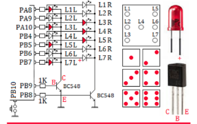
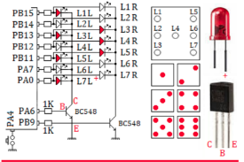

# Trabalho de Recuperação - Prova 1

O trabalho proposto como segue a descrição, é composto da montagem de um circuito conforme diagrama elétrico indicado na figura e de um programa para fazer este circuito funcionar conforme a descrição que será apresentada. SE o aluno escrever apenas o programa (bem comentado) que resolve o problema, o aluno receberá 0,5 pontos a mais no grau da prova P1. SE o aluno montar o circuito de forma coerente o mesmo recebe 1,0 ponto a mais no grau da prova P1. SE o aluno montar, escrever o programa e apresentar o circuito funcionando, então o mesmo receberá 2,5 pontos a mais no grau da prova P1.

Observe os circuitos representados na figura abaixo. Eles representam um “Jogo de Dados” com dois dados cada um. SE o grau obtido na prova P1 e multiplicado por 10 resultar em um número par, então o circuito que você deve observar é o da ESQUERDA. SE der impar então o circuito é da DIREITA. Ambos os circuitos contam com uma chave, dois “dados” compostos por 7 LEDs e dois transistores. Ao apertar o botão o programa gera dois números pseudo-aleatórios os quais vão acionar os “dados” (ver figura para codificação) de forma apropriada.

|
:-------------------------:|:-------------------------:
Esquerda | Direita

Escreva uma função que meça quanto tempo o botão ficou pressionado (em milissegundos). Esta função será utilizada para inicializar a semente do gerador de números pseudo-aleatórios (srand(n)), dada pela medida do tempo que o botão pressionado três vezes (x1, x2, x3) e pela seguinte expressão matemática:

```
n = ((1 ≪ 10). (x1 + x2 + x3)) % 38000
```

Onde x1, x2 e x3 são valores de tempo dados em milissegundos retornados pela função mede. Este processo de inicializar a semente (srand(n)) é feito uma única vez. Após isto o programa fica em loop aguardando que o usuário pressione e solte o botão para então os dados serem jogados. Observe que os dados formam um display multiplexado de dois dígitos. Escreva o programa de forma que o display pareça estar estático (sem piscar).

Obs.: A Data de entrega do trabalho é até 20/05. A documentação deve ser impressa e entregue ao professor. A apresentação (caso tenha) deve ser combinada com o professor. O trabalho pode ser feito em duplas, mas só por quem realizou a prova. Em caso de duplas, se os graus atingidos resultarem em notas pares e impares (empate), faça então o circuito da direita.

Obs.: Este trabalho não é obrigatório. O estudante decide se quer ou não fazê-lo! O grau da prova P1 não é alterado para quem não fizer o trabalho.