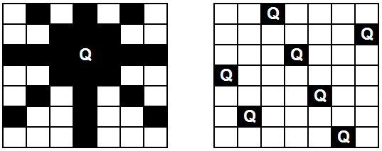

# Problema das n-rainhas

## O problema

O problema das N-rainhas consiste em encontrar uma combinação possível de N rainhas num tabuleiro de dimensão N por N tal que nenhuma das rainhas ataque qualquer outra. Duas rainhas atacam-se uma à outra quando estão na mesma linha, na mesma coluna ou na mesma diagonal do tabuleiro. Na figura que se segue pode ver-se as posições atacadas por uma rainha colocada num tabuleiro de dimensão 7 por 7 e ao lado uma possível solução para esse mesmo tabuleiro.

1. Desenvolver uma aplicação que resolva o problema das n-rainhas, encontrando uma solução válida para o problema. Como entrada, o programa recebe um valor para n >= 2, e retorna a disposição das rainhas no tabuleiro. Utilize uma estratégia de backtracking.

1. Ajuste o algoritmo anterior, para que retorne todas as soluções possíveis.