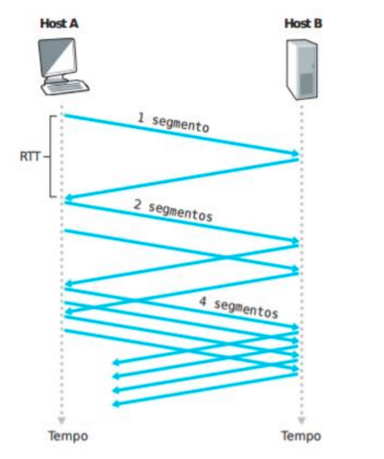
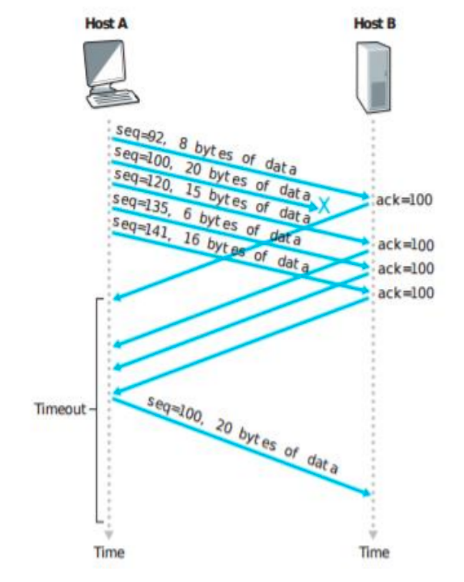

# Definição do Trabalho Final

Implementar uma aplicação com o protocolo UDP que simule o comportamento de um protocolo de transferência de arquivos orientado à conexão. Para tanto, os seguintes mecanismos deverão ser implementados:

* Estabelecimento e encerramento da conexão
* Sequenciamento das mensagens
* Controle de erro das mensagens
* Envio de dados (arquivos que serão selecionados do computador).
* Controle de congestionamento

A aplicação deverá implementar duas técnicas de controle de congestionamento utilizadas pelo protocolo TCP:

* *Slow Start*: A técnica *Slow Start* tem um crescimento exponencial. A ideia é que a aplicação comece com a transmissão de um pacote e vá aumentando a taxa de envio (2, 4, 8, 16...) à medida que as confirmações cheguem do destino.
* *Fast Retransmit*: É uma técnica que faz a retransmissão imediata de um pacote ao receber 3 ACKs duplicados.

|
:-------------------------:|:-------------------------:
**Figura 1:** Slow Start. | **Figura 2:** Fast Retransmit.

A aplicação não terá que definir um tamanho de janela de transmissão e a retransmissão de um pacote poderá acontecer por dois problemas: *timeout* e a recepção de 3 ACKs duplicados. Em ambos os casos, a aplicação volta ao início do *Slow Start*, ou seja, começa a retransmissão com 1 pacote e vai crescendo exponencialmente.

Os números de sequência devem começar em zero e ir incrementando de acordo com a quantidade de pacotes que está sendo transmitida. O número do ACK representa o número de sequência mais 1, ou seja, indica o número do pacote que o destino deseja receber.

O controle de erro deve ser realizado pela própria aplicação através de um algoritmo de cálculo de CRC já existente. O valor do CRC deve ser incluído no pacote e o destino, ao recebê-lo, deve recalcular o CRC para identificar se o pacote chegou corretamente. Caso o pacote esteja correto, um ACK do número de sequência mais 1 deve ser enviado. Caso contrário, o destino deve somente descartar o pacote recebido.

Todo o pacote recebido pelo destino deve ser confirmado e o destino deve ter um controle dos números de sequência que já recebeu. Ele não pode confirmar a recepção de um pacote com um determinado número de sequência, se o pacote com número de sequência menor não foi confirmado. Neste caso, um ACK com o número de sequência do último pacote já confirmado deve ter transmitido.

O usuário que utiliza a aplicação deve escolher um arquivo qualquer do sistema
operacional para enviar para o destino, sendo esse passado como um parâmetro. Este arquivo deverá ser dividido em partes de 512 bytes e enviado para o destino, seguindo a implementação das técnicas de controle de congestionamento mencionadas acima. O destino, conforme for recebendo todos os pacotes que fazem parte do arquivo original, deve remontá-lo e salvá-lo em um arquivo. Todos os pacotes do nível de aplicação devem ter 512 bytes, inclusive o último pacote, assim a aplicação deve controlar o *padding* caso o último pacote não chegue a esse valor. Após atransmissão de todo o arquivo, o usuário deve utilizar o comando ***md5sum*** ou ***shasum*** (na origeme no destino) para validar o recebimento correto do arquivo.

Quanto ao tipo de sockets a ser utilizado na aplicação para a comunicação, deve-se observar que a comunicação deve ser implementada com ***socket UDP (Datagram Socket)***, para envio e recebimento das mensagens.

Para que a perda de pacotes ocorra será necessário utilizar o *netem* (http://www.linuxfoundation.org/collaborate/workgroups/networking/netem) para Linux ou *clumsy* (https://github.com/jagt/clumsy) para Windows.

Durante o envio do arquivo, a aplicação deve imprimir um log na tela do que está acontecendo na transmissão, tanto no lado da máquina origem, como no lado do destino.

## Regras Gerais

**Grupos**: No máximo 03 alunos.

**Data de entrega e apresentação**: 29/06

**Obs.: Todos participantes devem estar presentes**

**Entrega final no Moodle**:
* Texto descrevendo a estrutura da solução dada (formato dos pacotes), envolvendo estruturas de dados, *threads*, procedimentos (ou classes), mecanismos de sincronização utilizados.
* Código fonte comentado.

**IMPORTANTE**: Não serão aceitos trabalhos entregues fora do prazo. Trabalhos que não compilam ou que não executam não serão avaliados. Todos os trabalhos serão analisados e comparados. Caso seja identificada cópia de trabalhos, todos os trabalhos envolvidos receberão nota ZERO.