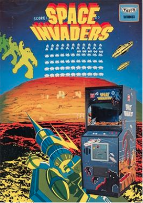
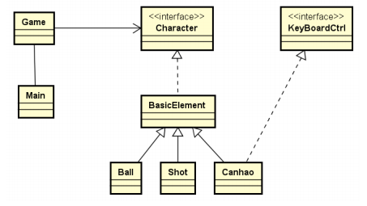

# Trabalho Final – 2020/2 - Programação Orientada a Objetos

**Space Invaders** is a 1978 `arcade game` created by `Tomohiro Nishikado`. It was manufactured and sold by `Taito` in Japan, and licensed in the United States by the `Midway` division of `Bally`. Within the `shooter genre`, *Space Invaders* was the first `fixed shooter` and set the template for the shoot 'em up genre. The goal is to defeat wave after wave of descending aliens with a horizontally moving laser to earn as many points as possible.

…

`Space Invaders` is a fixed shooter in which the player controls a `laser cannon` by moving it horizontally across the bottom of the screen and firing at descending aliens. The aim is to defeat five rows of eleven aliens—although some versions feature different numbers—that move horizontally back and forth across the screen as they advance toward the bottom of the screen. The player's laser cannon is partially protected by several stationary defense `bunkers`—the number also varies by version—that are gradually destroyed from the top and bottom by blasts from either the aliens or the player. (https://en.wikipedia.org/wiki/Space_Invaders)

## Objetivos 

O objetivo deste trabalho é demonstrar domínio dos conceitos básicos de programação orientada a objetos estudados na disciplina de Programação Orientada a Objetos, em especial herança e polimorfismo, organização de código, uso de lambdas, exceções e arquivos, criação de interface com o usuário usando JavaFX.

## Tema do trabalho

O trabalho deverá implementar um jogo ao estilo “Space Invaders” a partir do framework fornecido pelo. Este framework constitui-se de uma série de classes e interfaces detalhadas na sequência (ver figura 1) a partir das quais deverão ser derivados os personagens e as regras de funcionamento do jogo. Você pode fazer adições/alterações ao modelo conforme a necessidade, mas deve ser mantida, pelo menos, a hierarquia de classes proposta.

**Figura 1** - Diagrama de classes.

O jogo consiste de uma série de personagens animados (os invasores) que descem em direção a parte de baixo da tela através de movimentos próprios. O objetivo do jogador é controlar um canhão que se movimenta para a direita ou esquerda na parte de baixo da tela e que é capaz de atirar para eliminar os invasores. Na medida em que os invasores são eliminados o jogador acumula pontos. O jogo só acaba se algum invasor atinge a parte de baixo da tela ou se o canhão é destruído (eventualmente os invasores também atiram em direção ao canhão).

### Regras para a implementação

* Devem existir diferentes tipos de personagens que são representados por uma hierarquia de herança. Cada tipo de personagem tem uma aparência e um comportamento diferente. Por exemplo, alguns apenas se movimentam lentamente da esquerda para a direita e da direita para a esquerda, e sempre que chegam numa extremidade eles descem. Alguns podem ter um movimento semelhante, mas também podem atirar. Outros também podem ser mais difíceis de eliminar, necessitando receber dois ou mais tiros para serem eliminados. Por fim pelo menos um dos tipos deve prever comportamento de grupo.

* Os personagens devem, obrigatoriamente, serem derivados das classes fornecidas
explorando adequadamente os conceitos de programação orientada a objetos.

* A interface com o usuário deve ser aprimorada usando JavaFX (contagem de pontos, início e suspensão do jogo, configurações, etc.).

* O jogo deve ser capaz de manter a relação das 10 melhores pontuações em arquivo. Ao final de cada jogo deve ser apresentado o escore obtido pelo jogador e o ranking atual.

### Restrições no jogo

* Devem existir pelo menos 4 tipos de invasores diferentes.

* Pelo menos um dos tipos de invasores deve ser capaz de atirar contra o canhão.

* Pelo menos um dos tipos de invasores deve prever comportamento de grupo.

* O objetivo do jogo deve ser eliminar todos os invasores antes que eles cheguem na parte de baixo da tela.

* Conforme o usuário elimina invasores, novos tipos invasores vão surgindo. A cada nova “fase”, ou seja, quando surgem novos invasores, a velocidade deles deve aumentar, de maneira a aumentar complexidade do jogo. Cada invasor eliminado pontua conforme seu tipo.

* A implementação deve ser capaz de detectar o final do jogo: ou um invasor chega na parte de baixo da tela ou todos os canhões são destruídos (cada jogador inicia com três canhões). O objetivo é fazer o maior número de pontos antes que o jogo acabe.

### Código fornecido

* O código fonte fornecido reflete o diagrama de classes da figura 1. A versão atual implementa um sistema que demonstra o uso das classes, numa versão limitada do jogo.

## Desenvolvimento, apresentação e avaliação do trabalho

* O trabalho pode ser realizado individualmente ou em grupos de, no máximo, 3 alunos.

* O grupo deve preparar uma apresentação inicial (em torno de 5 minutos) expondo suas decisões de projeto, organização do código e resultados, seguido de 5 a 7 minutos de apresentação das funcionalidades desenvolvidas para o jogo.

* Durante a apresentação, se possível, todos os alunos devem estar presentes e aptos a responder às perguntas.

* A apresentação do trabalho é de inteira responsabilidade dos alunos e o código-fonte utilizado deverá ser o mesmo entregue ao professor. É tarefa do grupo garantir que o sistema esteja apto a ser executado na data/hora da apresentação.

* Sistemas que não consigam ser executados ou apresentados no dia da apresentação não serão avaliados.

* Mensagens de erro apresentadas durante a execução do programa, mesmo que a aplicação não pare de executar, serão consideradas como erros de execução, e acarretarão descontos na nota do trabalho.

* Em caso de erro de sintaxe (compilação), o peso final do trabalho será valorado em zero.

* Em caso de erro de semântica (conteúdo), o peso final do trabalho sofrerá uma redução.

* Os trabalhos serão avaliados de acordo com critérios a serem estabelecidos pelo professor da disciplina, considerando o que é pedido no enunciado e o que foi realizado com sucesso pelo sistema.

* Não serão aceitos trabalhos enviados fora dos prazos estabelecidos.

* Trabalhos copiados resultarão em nota zero para todos os alunos envolvidos.

## Entrega final do trabalho

* Todos os arquivos modificados ou desenvolvidos pelo grupo devem ter o nome e matrícula de todos os componentes do grupo, bem como um link na classe principal, para o repositório (privado) no Github utilizado pelo grupo.

* Todos os componentes do grupo devem se registrar na atividade de escolha de grupos, apenas um dos componentes do grupo necessita fazer o upload da versão final do projeto.

* A entrega no Moodle deve ser na forma de um arquivo zip contendo a implementação feita (todas as pastas e os arquivos .java). Este arquivo deve ter o nome e sobrenome do(s) aluno(s), da seguinte forma: nome_ultimosobrenome-nome_ultimosobrenome.zip. Deve ser feito o upload deste arquivo na tarefa Moodle até a data e horário especificados. Sugestão: apenas fazer o download do projeto do github e alterar o nome do arquivo como solicitado.

* A documentação deve ser realizada na forma de um relatório técnico e entregue em formato PDF. Devem fazer parte da documentação pelo menos:
  * Descrição do problema.
  * Diagrama de classes do sistema. O diagrama de classes deverá ser entregue junto com documentação em texto salientando as modificações realizadas pelo grupo, se alguma.
  * Descrição dos principais algoritmos desenvolvidos
  * Dificuldades e lições aprendidas.

* Não serão aceitos trabalhos enviados por correio eletrônico.